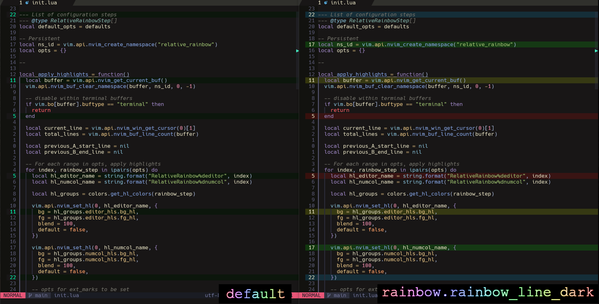
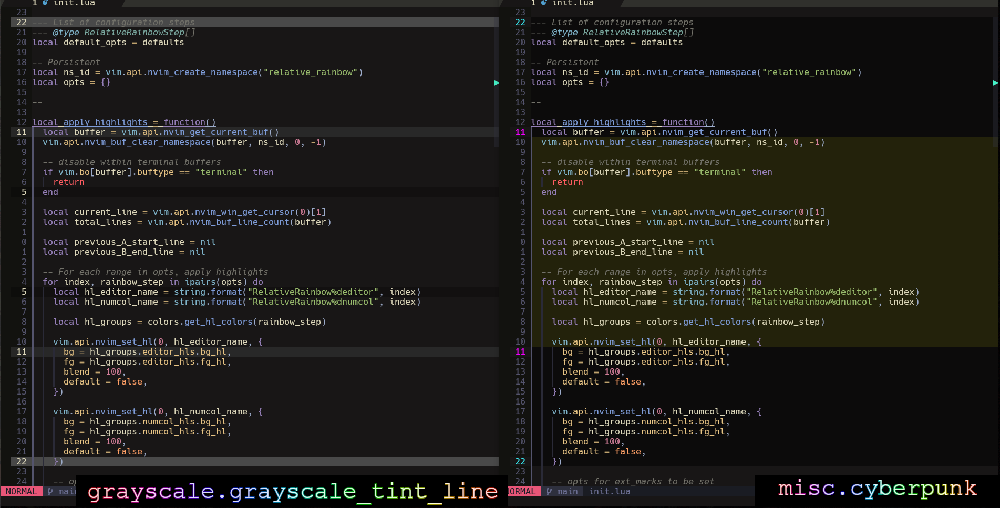

# relative-rainbow.nvim

Neovim plugin for quick visual hints of relative distances from your cursor




## Motivation
- Colors require less mental bandwidth to parse than a long list of numbers
- Zip around files quickly, just like a rainbow does.

---

## Installation

### With `lazy.nvim`
```lua
{
  'fluxdiv/relative-rainbow.nvim',
  config = function()
    require("relative-rainbow").setup()
  end
}
```

### With Packer
```lua
use {
  'fluxdiv/relative-rainbow.nvim',
  config = function()
    require("relative-rainbow").setup()
  end
}
```

## Basic Usage

### Default config
To use the default config just call `.setup()` with no params/nil (see `./lua/relative-rainbow/config/defaults.lua`)
```lua
require("relative-rainbow").setup()
```

### Template configs
`relative-rainbow.nvim` includes multiple template configs (see `./lua/relative-rainbow/config/templates/`)
```lua
{
  'fluxdiv/relative-rainbow.nvim',
  config = function()
    local grayscale_templates = require("relative-rainbow.config.templates.grayscale")
    -- require("relative-rainbow").setup(grayscale_templates.grayscale_tint_line)

    local rainbow_templates = require("relative-rainbow.config.templates.rainbow")
    -- require("relative-rainbow").setup(rainbow_templates.rainbow_line_dark)

    local misc_templates = require("relative-rainbow.config.templates.misc")
    require("relative-rainbow").setup(misc_templates.cyberpunk)
  end
}
```

### Custom config
You can customize your config by passing a table of config options to `.setup()`. Each entry represents a "step" and supports the following fields:
- `distance_from_cursor` (number): Distance from cursor to apply highlight
- `hl_target` ("number_column"|"editor"|"both"|nil): Where to apply highlight. Defaults to `"both"`. See example images for more details
- `fill` (boolean): If `true`, highlights the entire range. If `false` only highlights the 2 individual lines @ `distance_from_cursor`. Defaults to `true`
- `bg` (string|nil): Solid background color in hex (ex "#FF0000") Overrides `bg_tint` if provided
- `bg_tint` (string|nil): Apply a tint color to current theme's bg (instead of a solid color)
- `bg_tint_multiplier` (number|nil): Strength of bg tint (between 0 and 1). Larger = stronger tint
- `fg` (string|nil): Solid fg color in hex. Overrides `fg_tint` if provided
- `fg_tint` (string|nil): Apply a tint color to current theme's fg
- `fg_tint_multiplier` (number|nil): Strength of fg tint (between 0 and 1). Larger = stronger tint

### Example custom config
```lua
{
  'fluxdiv/relative-rainbow.nvim',
  config = function()
    require("relative-rainbow").setup({
      -- Entry with all fields provided
      {
        distance_from_cursor = 5,
        hl_target = "both",
        fill = false,
        -- "bg" overrides "bg_tint" and "bg_tint_multiplier"
        bg = "#FF0000",
        bg_tint = "#000000",
        bg_tint_multiplier = 0.1,
        -- "fg" overrides "fg_tint" and "fg_tint_multiplier"
        fg = "#FF0000",
        fg_tint = "#000000",
        fg_tint_multiplier = 0.99,
      },
      -- Individual highlights for editor & number_column at same distance (same lines)
      {
        distance_from_cursor = 11,
        hl_target = "editor",
        bg_tint = "#000000",
      },
      {
        distance_from_cursor = 11,
        hl_target = "number_column",
        fg = "#00FFD0",
        fill = false,
      },
    })
  end
}
```
